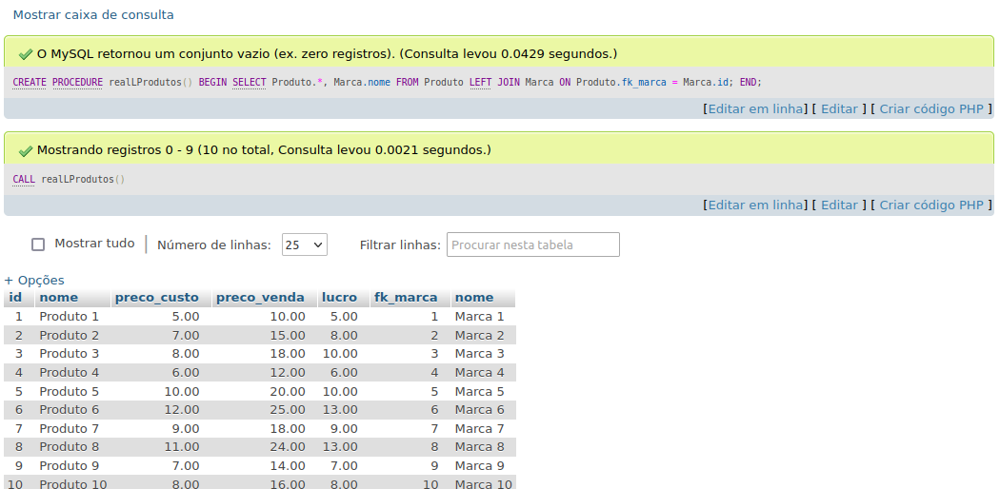
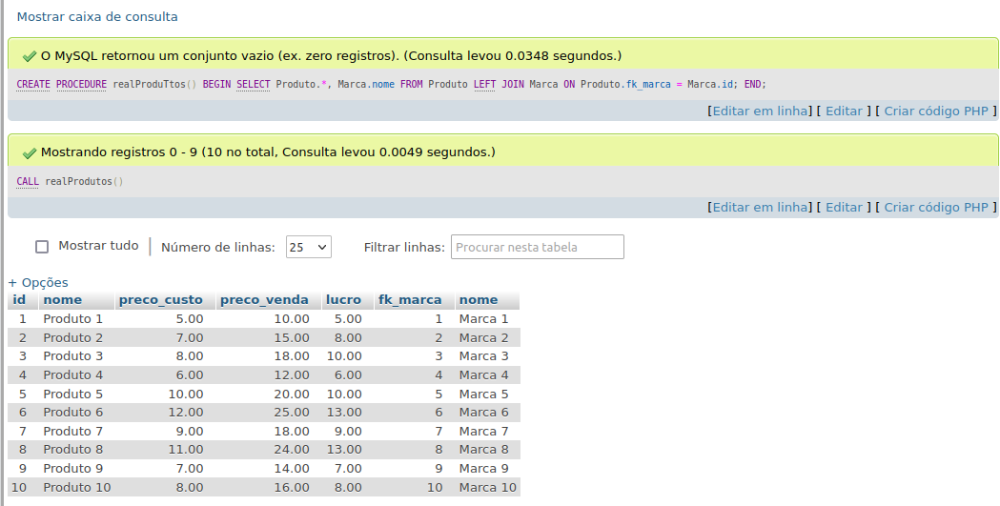
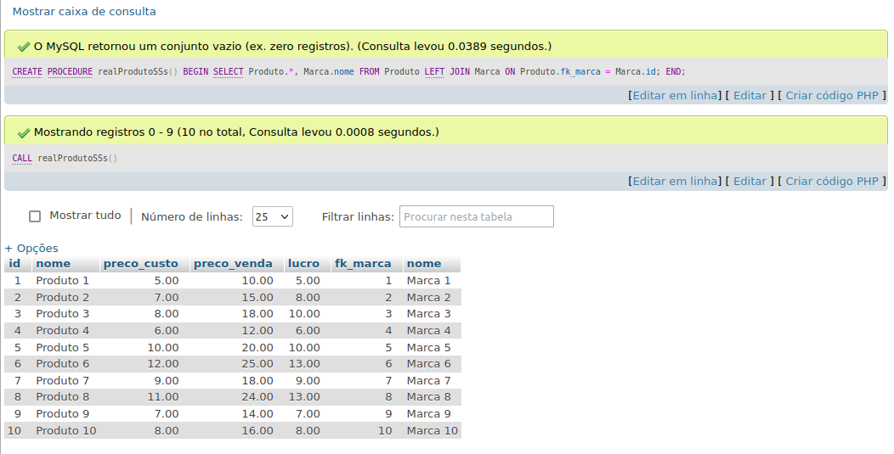

# Trigger Atividade individual - SQL 

Orientador: Daniel Oatha

<h1>-------- ---------------</h1>

A execução segue o que foi apresentado no slide.

Ao definir o delimitador como "$", você informa 
que agora o novo delimitador para o final de uma instrução é "$" em vez do ponto e vírgula 
";". Isso permite que você defina a stored procedure usando "$" como o delimitador.

volta para o padrão ";": Após criar com sucesso a stored procedure usando o novo delimitador "$", 
você restaura o delimitador para o padrão ";" usando DELIMITER ;
Agora, o sistema de gerenciamento de banco de dados voltará a reconhecer o ponto e vírgula como o delimitador de instrução padrão.

[Link Para Verificar o SQL](https://github.com/Leon14789/Comercio-Eletr/blob/master/sql)
